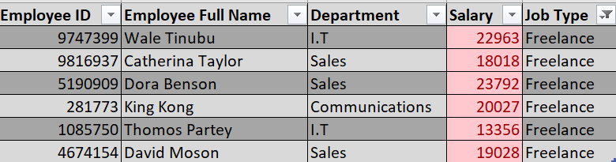
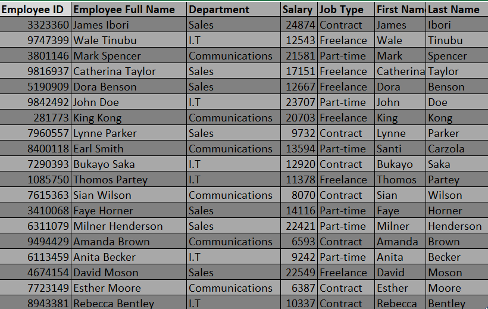
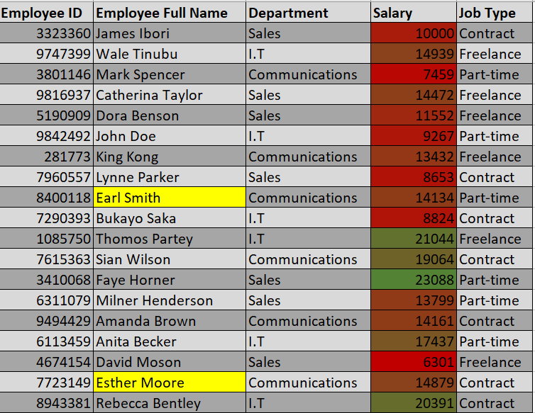
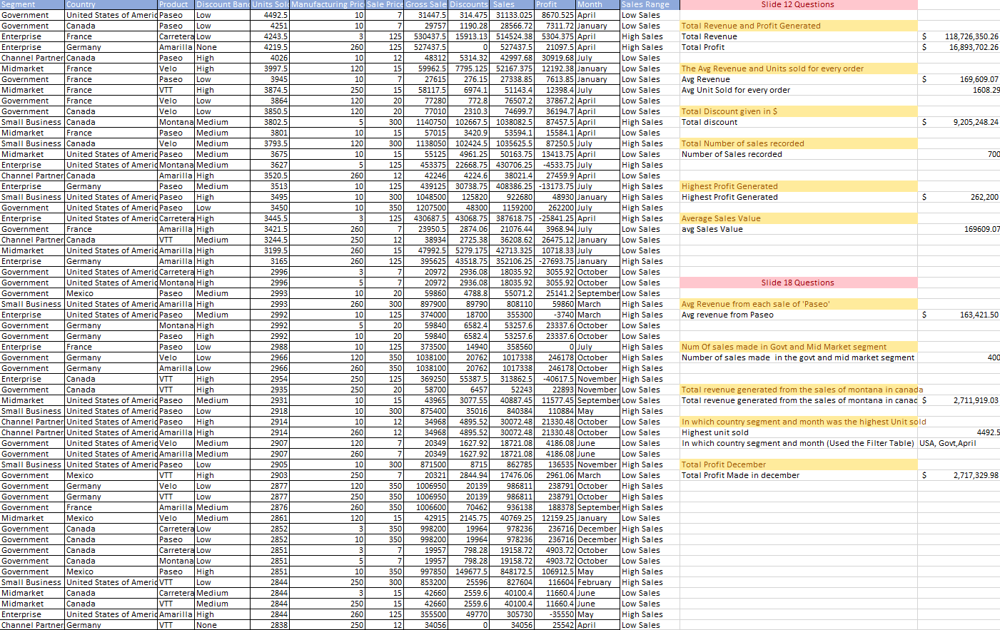

# Microsoft Excel Assignment by Obafemi Ayeni

## Introduction
This is an assignment to test my knowledge about Microsoft excel during my on going training by Promise Chinonso

**_Disclaimer_**: _All dataset does not represent any company, institution or country but a dummy dataset to demonstrate capabilities of Microsoft excel._

## Problem statement
In worksheet 1 show only employees who are 'Freelancers' and highlight the ons whose salaries are above $10000

In **worksheet 2**, split the employees' first and last name. Check for duplicates and highlight if any (do not delete)

In **worksheet 3**, highlight employees whose names begin with the letter 'E'(in yellow). Format the salary column such that the highest SALARY has a green background and the lowest SALARY has a red background.

On **Sales Data** worksheet determine the following 

i). The total revenue and profit generated 

ii). The average revenue and units sold for every order

iii). The total discount given in $

iv). Total number of sales recorded

v). The highest profit generated

vi). create a column named 'sales Range' return 'High Sales' if the sales values is above average, otherwise, return 'Low Sales'.

vii). The average revenue generated from each sale of 'Paseo'

viii). The number of sales made in the Government and Midmarket segment.

ix). The total revenue generated from the sales of 'Montana' in canada

x).In which country, segment and Month was the highest unit of goods sold?

xi). What is the total profit made in December?

## Skill/ Concepts Demonstrated

The following Microsoft excel skills and formulae were incorporated- 

- Data filtering
- Sorting Data
- Conditional formatting,
- Splitting and Joining cells
- Conditional functions 

## Worksheet Visuals 

Worksheet 1                     |  Worksheet 2
:------------------------------:|:-----------------------:
                 | 

Worksheet 3                    |  Sales Data Worksheet
:------------------------------:|:-----------------------:
                 | 

